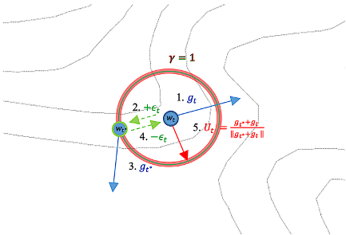
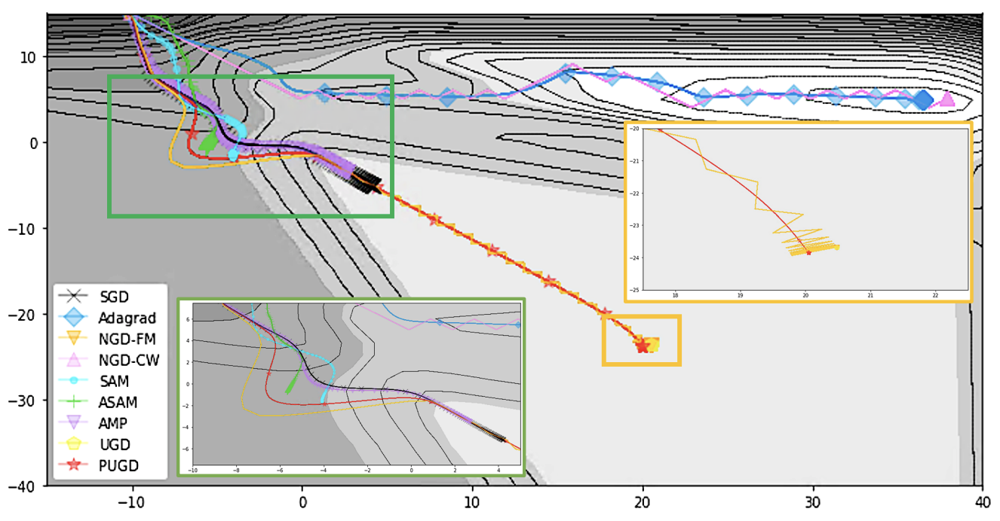

# PUGD

The implement code of Perturbated Gradients Updating within Unit Space for Deep Learning

## Acknowledgement
This project highly references these links, ([1](https://github.com/kuangliu/pytorch-cifar) and [2](https://github.com/davda54/sam)).

## Usage

### Prerequirement
There is a pre-defined package throught `pipenv` in `./Pipfile`. Please install the needed packages in:

`$ pipenv install` 

In this step, the `pipenv` will automatically get the **Pipfile.lock** and install the needed parameter or packages as the **Pipfile** content.

### Simple usage 
In this project, we implement PUGD with UPANets in `./models/upanets.py`. The simple usage is:

`python main.py`

If you install the needed packages through `pipenv`, please use:

`pipenv run python main.py`

## Mode
There are two modes for updating, include: closure and separate

The default mode is closure. The example of cmd and code are:

if closuer:

cmd:

`$ python main.py --mode closure`

code:

>             def closure():
>                 
>                 outputs = net(inputs)
>                 loss = criterion(outputs, targets)
>                 loss.backward()
> 
>             outputs = net(inputs)        
>             loss = criterion(outputs, targets)       
>             loss.backward()
>             optimizer.step(closure)

if separate

cmd:

`$ python main.py --mode separate`

code:

>             outputs = net(inputs)        
>             loss = criterion(outputs, targets)       
>             loss.backward()
>             optimizer.first_step()
>             
>             outputs = net(inputs)        
>             loss = criterion(outputs, targets)       
>             loss.backward()
>             optimizer.second_step(zero_grad=True)

